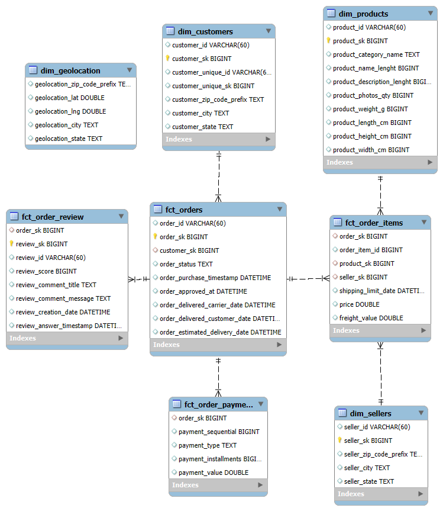

# **Olist E-Commerce: Full-Stack Analytics & Customer Segmentation**
**Author**: Thu Pham | **Date**: 10/2025

## *Table of Contents*
1. [Project Background](#1-project-background)  
2. [Data Structure](#2-data-structure)  
3. [Executive Summary](#3-executive-summary)  
4. [Insights Deep Dive](#4-insights-deep-dive)  
5. [Sales Forecasting Model](#5-sales-forecasting-model)  
6. [Recommendations](#6-recommendations)  

## _**1. Project Background**_
**Olist** is a E-commerce marketplace that connects small businesses (sellers) to customers across the country. As an internal Data Analyst, I have been tasked with analyzing the company's performance from 2016 to 2018 to identify growth opportunities and operational bottlenecks.

The business has seen rapid volume growth since the first operation in 2016, However, this scale has introduced challenges: _weak customers retention and negative reviews_. This project aims to deliver a comprehensive assessment of the company’s operations,  turning raw data into practical strategic insights that strengthen the fulfillment funnel and unlock long‑term customer value.

**_Insights and recommendations are provided on the following key areas:_**
- **Executive Sales Overview:** Assess the overall health of the business by tracking GMV, order volume trends, and _**Average Order Value (AOV)**_ to distinguish between growth driven by acquisition versus customer value.
- **Logistics & Operations:** Identify bottlenecks in the fulfillment funnel and evaluate customers satisfaction.
- **Product & Category:** Identify top-performing categories (Pareto analysis) and high-risk to optimize inventory management.
- **Customer Insights:** Segment the customer base using RFM analysis and K-Means clustering to distinguish "Champions" from "Lost" customers and develop targeted strategies.

_**Technical Stack:**_
- SQL (MySQL): Data warehousing, ETL, and logic views.
- Python (Pandas/Scikit-Learn): Data cleaning, feature engineering, and K-Means clustering.
- Power BI: Visualizing and Storytelling with interactive dashboards.

The Python scripts used for the ELT pipeline and Inference Engine can be found [here](code).

The Python and SQL scripts to data preparation and EDA can be found [here](code/Data_preparation.ipynb) and [here](code/EDA.ipynb).

The SQL views used for dynamic scoring can be found [here](code/view_rmf_base_script.sql).

An interactive Power BI dashboard used to explore these insights can be found [here](https://app.powerbi.com/view?r=eyJrIjoiYzRlM2QzYmQtY2I1Yi00NDg0LWI0MzItMjFhZjM0YThjMGE2IiwidCI6IjE2NzIwYmVkLTY1ZWItNGFhMi04ZjMwLWQxY2UxNzBjZjAwMCIsImMiOjEwfQ%3D%3D&pageName=000e5656b61190d4c961).

## **2. Data Structure**
This project utilizes a structured data model **built in MySQL** (`db_olist_analytics`) to ensure accurate reporting. The company database is organized into two main types of tables: **Fact Tables** (which record business events like orders) and **Dimension Tables** (which describe the "who, what, and where").

**Schema Diagram:**

**Key Tables Description:**

- **`fct_orders`**: The central log of every order placed. It tracks the entire lifecycle of an order, from the moment it is purchased to when it is approved, shipped, and delivered. It consists of **_~90K rows_**.
- **`fct_order_items`**: The detailed shopping cart for each order, listing individual product purchased, their prices, shipping cost, and which seller provided it.
- **`fct_order_payment`**: A record of how money changed hands. It tracks the payment method (Credit Card, Voucher), the total value, and installment plans for every transaction.
- **`fct_order_review`**: This table stores the satisfaction score (1-5 stars) and comments for each completed order.
- **`dim_customers`**: The master list of our customers, each customers has an unique ID and possibly more than one `customer_id` corresponding to each of their orders. The table also includes the relative locations of the orders/customers.
- **`dim_products`**: The catalog of items. It describes the products being sold, including their category, size, and weight.
- **`dim_sellers`**: The partner network. This table contains profiles for the merchants selling on our platform, specifically their location.

**Data Integrity & Cleaning:**

Before analysis, a rigorous cleaning process was applied to the raw data to ensure our insights are based on high-quality information:
- _Anomaly Removal:_ We identified 1,099 orders marked as "delivered" that were missing critical timestamp data (like when they were approved). These were excluded to prevent skewed speed metrics.
- _Consistency Checks:_ We removed "orphan" records—for example, reviews or payments that were linked to orders that didn't exist—to ensure every data point connects correctly.
- _Standardization:_ We cleaned up messy text fields and standardized categories (e.g., ensuring payment types are named consistently) to make the reporting clear and readable.

## _**3. Executive Summary**_
**Overview of Findings**

Analysis of Olist's performance _(2016-2018)_ reveals **_a business driven heavily by new customer acquisition_** (total orders **YoY ~21.5%**). While the platform has successfully grown its visitor base, retention remains a critical challenge, **_as one-time buyers account for the vast majority of transactions_** (**~87%**). Product performance follows a steep Pareto distribution, where just 23% of categories generate 80% of total Gross Merchandise Volume (GMV). Operationally, rapid scaling has strained logistics, leading to a **slight decline in on-time delivery rates (YoY -2.2%)** —a key factor that directly correlates with lower customer sentiment and review scores.

