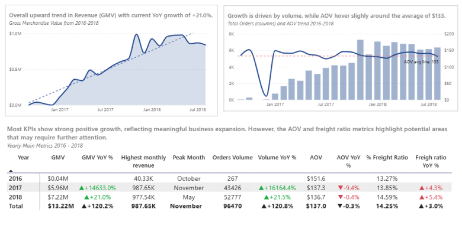
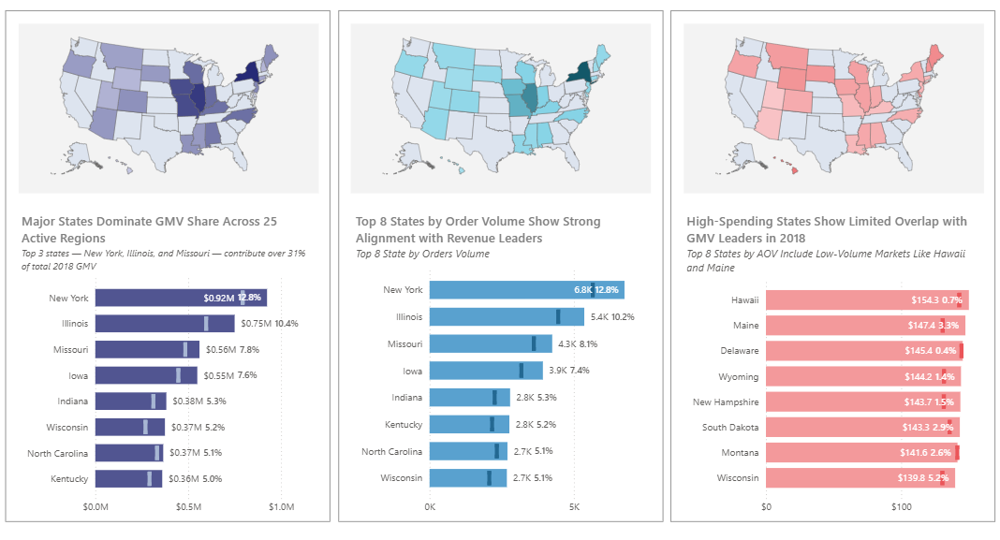
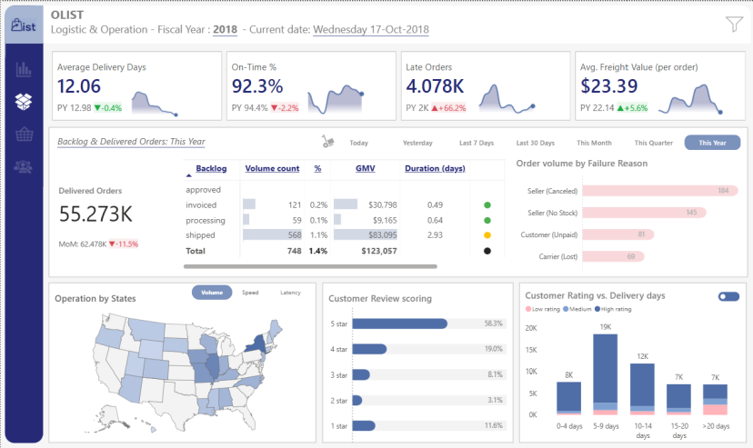
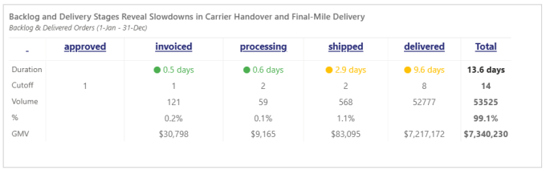
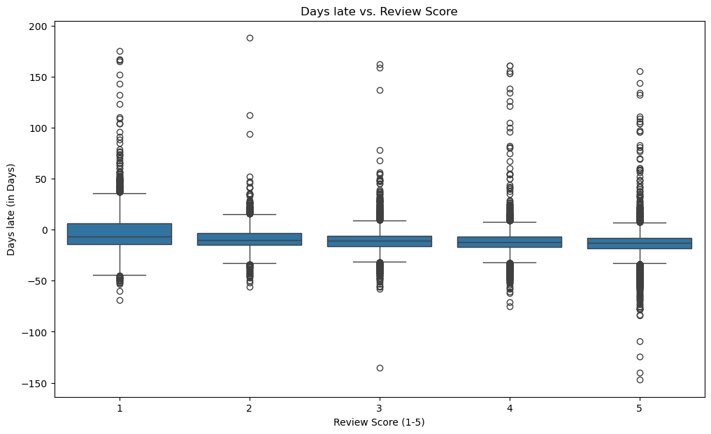
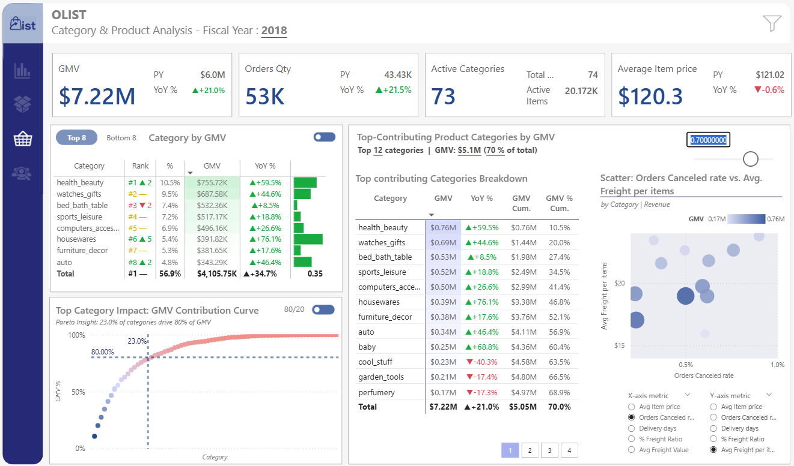
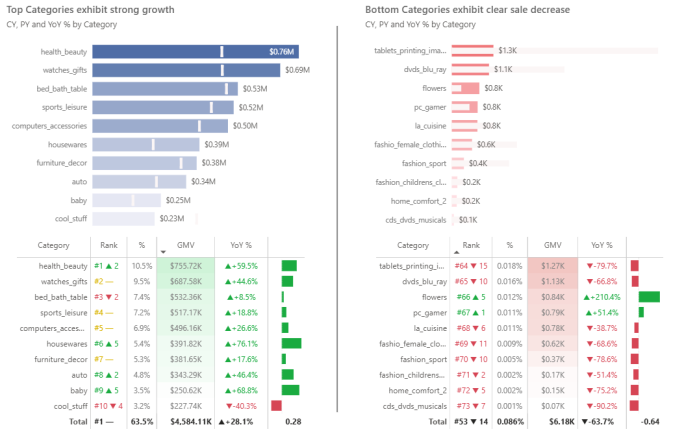
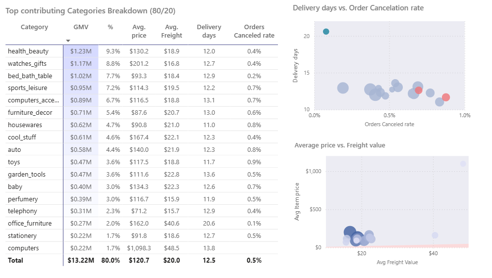

# **Olist E-Commerce: Full-Stack Analytics & Customer Segmentation**
**Author**: Thu Pham | **Date**: 10/2025

## *Table of Contents*
1. [Project Background](#1-project-background)  
2. [Data Structure](#2-data-structure)  
3. [Executive Summary](#3-executive-summary)  
4. [Insights Deep Dive](#4-insights-deep-dive)  
5. [Sales Forecasting Model](#5-sales-forecasting-model)  
6. [Recommendations](#6-recommendations)  

## _**1. Project Background**_
**Olist** is a E-commerce marketplace that connects small businesses (sellers) to customers across the country. As an internal Data Analyst, I have been tasked with analyzing the company's performance from 2016 to 2018 to identify growth opportunities and operational bottlenecks.

The business has seen rapid volume growth since the first operation in 2016, However, this scale has introduced challenges: _weak customers retention and negative reviews_. This project aims to deliver a comprehensive assessment of the company’s operations,  turning raw data into practical strategic insights that strengthen the fulfillment funnel and unlock long‑term customer value.

**_Insights and recommendations are provided on the following key areas:_**
- **Executive Sales Overview:** Assess the overall health of the business by tracking GMV, order volume trends, and _**Average Order Value (AOV)**_ to distinguish between growth driven by acquisition versus customer value.
- **Logistics & Operations:** Identify bottlenecks in the fulfillment funnel and evaluate customers satisfaction.
- **Product & Category:** Identify top-performing categories (Pareto analysis) and high-risk to optimize inventory management.
- **Customer Insights:** Segment the customer base using RFM analysis and K-Means clustering to distinguish "Champions" from "Lost" customers and develop targeted strategies.

_**Technical Stack:**_
- SQL (MySQL): Data warehousing, ETL, and logic views.
- Python (Pandas/Scikit-Learn): Data cleaning, feature engineering, and K-Means clustering.
- Power BI: Visualizing and Storytelling with interactive dashboards.

The Python scripts used for the ELT pipeline and Inference Engine can be found [here](code).

The Python and SQL scripts to data preparation and EDA can be found [here](code/Data_preparation.ipynb) and [here](code/EDA.ipynb).

The SQL views used for dynamic scoring can be found [here](code/view_rmf_base_script.sql).

An interactive Power BI dashboard used to explore these insights can be found [here](https://app.powerbi.com/view?r=eyJrIjoiYmUxYjYyN2EtMmU3NS00NzRlLWI4ZjYtNDBjOTE0Y2Y1MDgzIiwidCI6IjE2NzIwYmVkLTY1ZWItNGFhMi04ZjMwLWQxY2UxNzBjZjAwMCIsImMiOjEwfQ%3D%3D&pageName=000e5656b61190d4c961)

## **2. Data Structure**
This project utilizes a structured data model **built in MySQL** (`db_olist_analytics`) to ensure accurate reporting. The company database is organized into two main types of tables: **Fact Tables** (which record business events like orders) and **Dimension Tables** (which describe the "who, what, and where").

**Schema Diagram:**

**Key Tables Description:**

- **`fct_orders`**: The central log of every order placed. It tracks the entire lifecycle of an order, from the moment it is purchased to when it is approved, shipped, and delivered. It consists of **_~90K rows_**.
- **`fct_order_items`**: The detailed shopping cart for each order, listing individual product purchased, their prices, shipping cost, and which seller provided it.
- **`fct_order_payment`**: A record of how money changed hands. It tracks the payment method (Credit Card, Voucher), the total value, and installment plans for every transaction.
- **`fct_order_review`**: This table stores the satisfaction score (1-5 stars) and comments for each completed order.
- **`dim_customers`**: The master list of our customers, each customers has an unique ID and possibly more than one `customer_id` corresponding to each of their orders. The table also includes the relative locations of the orders/customers.
- **`dim_products`**: The catalog of items. It describes the products being sold, including their category, size, and weight.
- **`dim_sellers`**: The partner network. This table contains profiles for the merchants selling on our platform, specifically their location.

**Data Integrity & Cleaning:**

Before analysis, a rigorous cleaning process was applied to the raw data to ensure our insights are based on high-quality information:
- _Anomaly Removal:_ We identified 1,099 orders marked as "delivered" that were missing critical timestamp data (like when they were approved). These were excluded to prevent skewed speed metrics.
- _Consistency Checks:_ We removed "orphan" records—for example, reviews or payments that were linked to orders that didn't exist—to ensure every data point connects correctly.
- _Standardization:_ We cleaned up messy text fields and standardized categories (e.g., ensuring payment types are named consistently) to make the reporting clear and readable.

## _**3. Executive Summary**_
**Overview of Findings**

Analysis of Olist's performance _(2016-2018)_ reveals **_a business driven heavily by new customer acquisition_** (total orders **YoY ~21.5%**). While the platform has successfully grown its visitor base, retention remains a critical challenge, **_as one-time buyers account for the vast majority of transactions_** (**~87%**). Product performance follows a steep Pareto distribution, where just 23% of categories generate 80% of total Gross Merchandise Volume (GMV). Operationally, rapid scaling has strained logistics, leading to a **slight decline in on-time delivery rates (YoY -2.2%)** — a key factor that directly correlates with lower customer sentiment and review scores.

## _**4. Insights Deep Dive**_

### _**4.1 Sales Growth is mostly volume-driven**_
- Revenue growth significantly from 2016 to 2018 (), primarily due to a dramatic increase of **total orders**, while the Average Order Value (AOV) remained relatively flat (hovering between $120 - $150). This indicates the business is scaling by acquiring more customers rather than increasing wallet share. 
- **Seasonality is evident**: The revenue peak in **_November 2017 (MoM: +52.4%)_** confirms that **Black Friday** is the most critical sales event for Olist.  Interestingly, **AOV dips slightly** during this period _(AOV declined by -6.4% compared to 10.2017)_, suggesting that while volume explodes, customers are buying discounted or lower-value items.
- **Areas to be improved and discussed**: - Compared to other metrics, **AOV shows a negative YoY growth of -0.4%**, and the **freight ratio increased by +5.4%** compared to 2017.
    - The decline in AOV may indicate **weaker customer spending power** or **lower pricing strategies** used to stimulate sales.
    - The increase in freight ratio could reflect rising operational pressure driven by **expanding order volumes and customer base**, resulting in elevated logistics costs. However, this could pose a risk to conversion rates. 

- **Sales by areas analysis** _**(in 2018)**_: 
    - GMV distribution concentrated in Leading States Among 25 Active Markets, 3op 3 states including New York, Illinois, and Missouri — **contribute over 31% of total GMV in 2018**.
    - **Order volumes across the top-performing states closely mirrored their GMV rankings**, indicating a consistent relationship between orders quantity and revenue generation. _New York led with 6.8K orders (12.8%)_, followed by Illinois and Missouri.
    - While GMV and order volume are concentrated in major states, **_the highest average spending per order in 2018 came from smaller markets_**. States like Hawaii ($154.3 - GMV 0.7%), Maine ($147.4 - GMV 3.3%), and Delaware ($145.0 - GVM 0.4%) topped the AOV chart despite contributing minimally to total GMV. 

### _**4.2 Logistics & Operations Bottleneck analysis**_

- While 2018 reflects some operational improvements, several key indicators raise concerns:
    - **Delivery Efficiency:** The average delivery time was reduced by nearly one day, **dropping from ~13 days in 2017 to 12.06 days** in 2018. This improvement suggests that efforts to streamline fulfillment processes have **_yielded positive results_**.
    - **Timeliness & Late Deliveries:** a 21% increase in order volume has strained logistics capacity, resulting in **a 66.2% surge in late orders year-over-year**. Consequently, **the on-time delivery rate declined to 92.3%**, down 2.2% from the previous year — signaling a need for better scalability in operations.
    - **Freight Costs:** The average freight cost per order **_rose by 5.6%_**, reaching $23.39. This increase aligns with business expansion but may also reflect rising pressure on transportation and infrastructure.

- **Analyzing the operation "funnel break" in 2018:** 
    - The 2018 operational funnel shows a clear bottleneck in the carrier handover ("`shipped`") and last-miled delivery ("`delivered`") stages, where both carrier pickup and last‑mile delivery are taking longer than their expected cutoffs. 
    - These longer lead times show strain on outbound logistics and highlight the need for closer coordination with carriers.

- **The "Funnel Break" is Inventory:** The largest source of revenue leakage is orders that are paid for but never shipped. In 2018, over more than **_~300 orders failed_** after payment approval due to seller inventory issues or cancellations. This points to a critical need for better inventory synchronization with sellers.

- **Predictability Drives Satisfaction:** Analysis shows that customer satisfaction (Review Score) is less dependent on pure speed and more on meeting expectations.
    - _**5-Star Reviews:**_ Orders typically arrive 13 days early (median), beating the promise.
    - _**1-Star Reviews:**_ Orders are highly unpredictable, with a median arrival of 7 days early but a wide variance that includes significant delays.
    - Conclusion: "Under-promising and over-delivering" on estimated delivery dates is the single most effective operational lever for customer happiness.

### _**4.3 Product and Category Performance**_ 

- Revenue is highly concentrated (80/20 Pareto principle): The **_top 23% of product categories (17 out of 73 actives) generate 80% of total GMV_**. `health_beauty` (10.5%) and `watches_gifts` (9.5%) are the clear "Hero" categories, driving consistent volume and high ticket sizes.

- Top categories growth: 
    - **`health_beauty`** is not only the largest category but also one of **_the fastest-growing (+59.5% YoY)_**, significantly outperforming the company average of 21%. `watches_gifts` (#2) also shows robust momentum with **+44.6% YoY growth**.
    - Several substantial categories are seeing alarming declines in sales volume despite the overall platform growth: **`cool_stuff` (-40.3%), `toys` (-43.8%)**.
- While the top categories continue to outperform their past results, the weaker categories have been shrinking sharply — _most notably in fashion_, where sales in female fashion and other fashion segments **_have fallen by 69% to 79%_**.

- **"Operational Matrix" - Delivery days vs. Canceled Rate**: Based on the analysis, the top‑contributing categories fall into three distinct operational profiles.
    - **Standard performers**: - Categories with a cancellation rate below 0.9% and delivery times under 12 days. The strongest performers belong to this group, including `health_beauty`, `watches_gifts`, and `bed_bath_table`.
    - **At risk**: The `toys` category shows a relatively **_high cancellation rate (0.88%)_** despite **_faster‑than‑average delivery_** (11.7 days vs. 12.5 days). Combined with its negative growth trend, this category requires immediate attention—such as deeper audits of sellers and outbound operations.
    - **Special case**: `office_furniture` has the longest logistics cycle (20.6 days) and high freight costs, yet maintains a low cancellation rate (0.1%). This suggests a unique operational model that differs from the rest of the portfolio.

